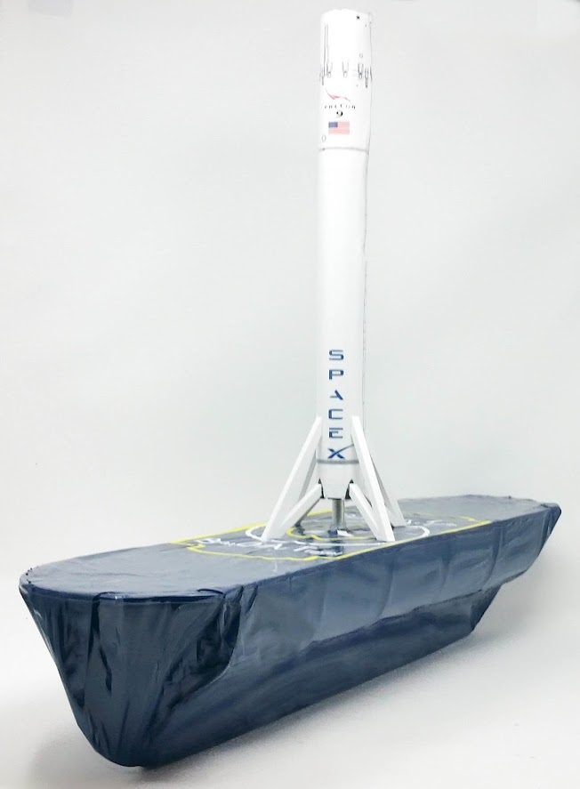
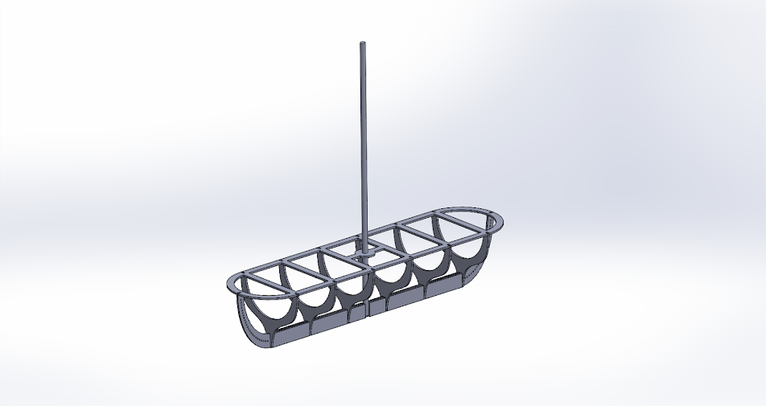
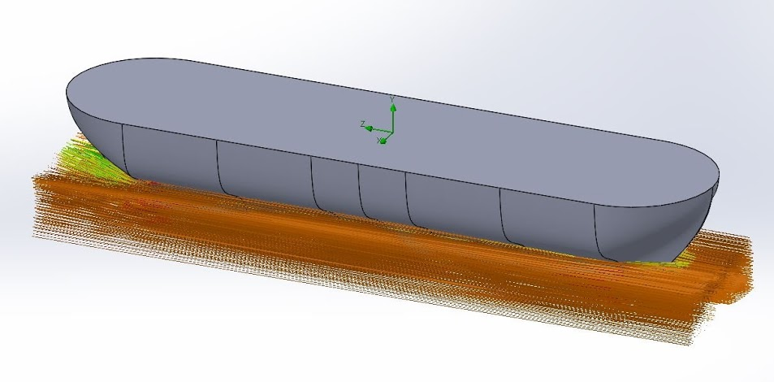
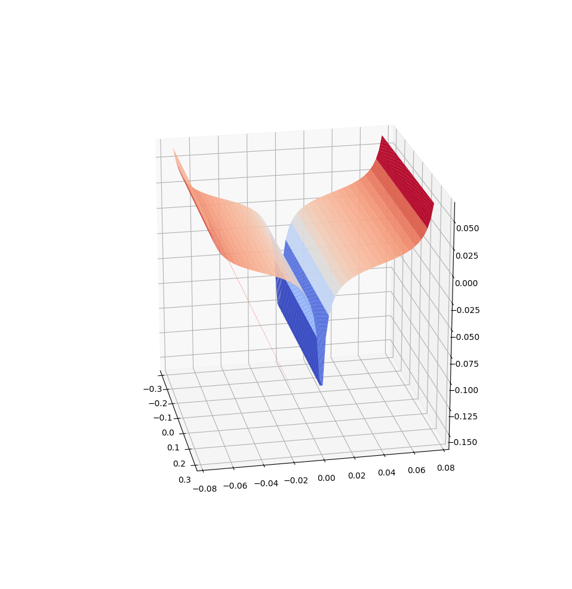
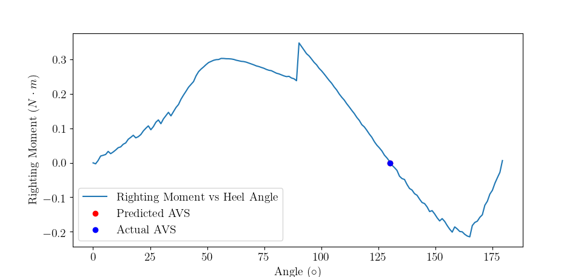
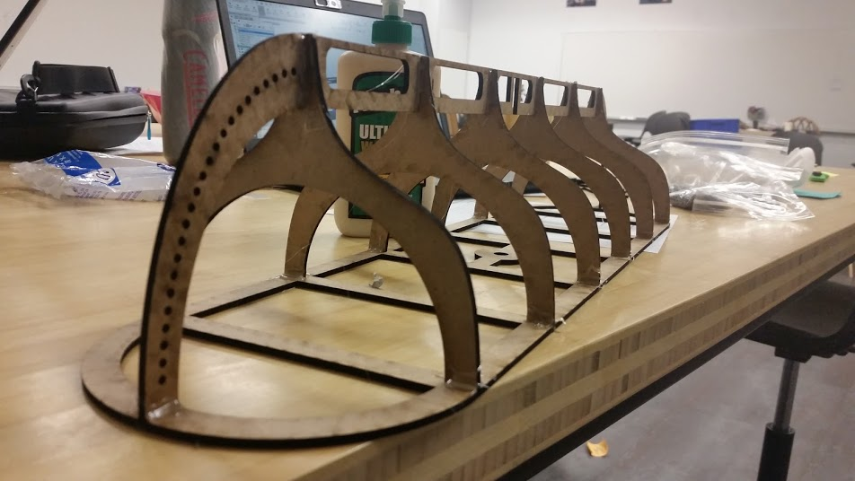
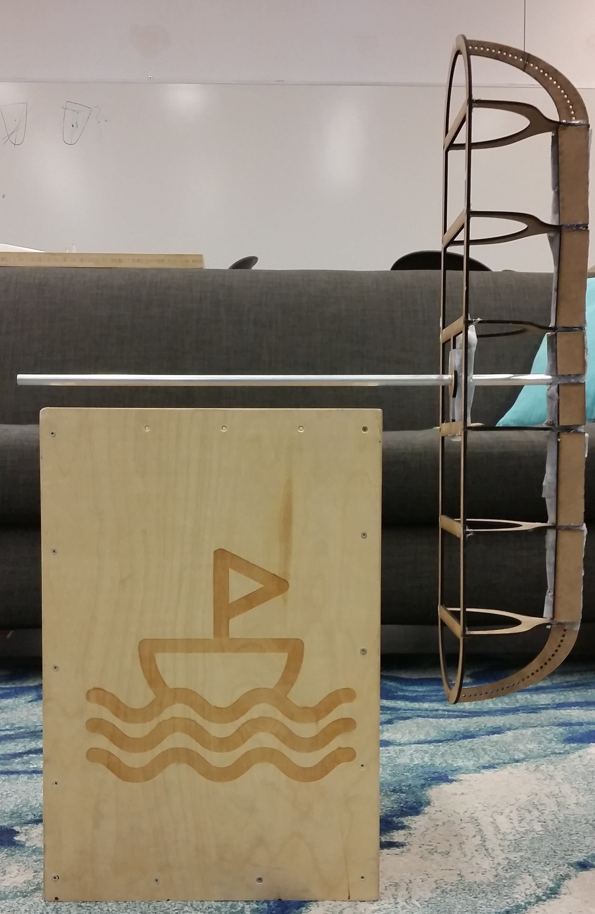
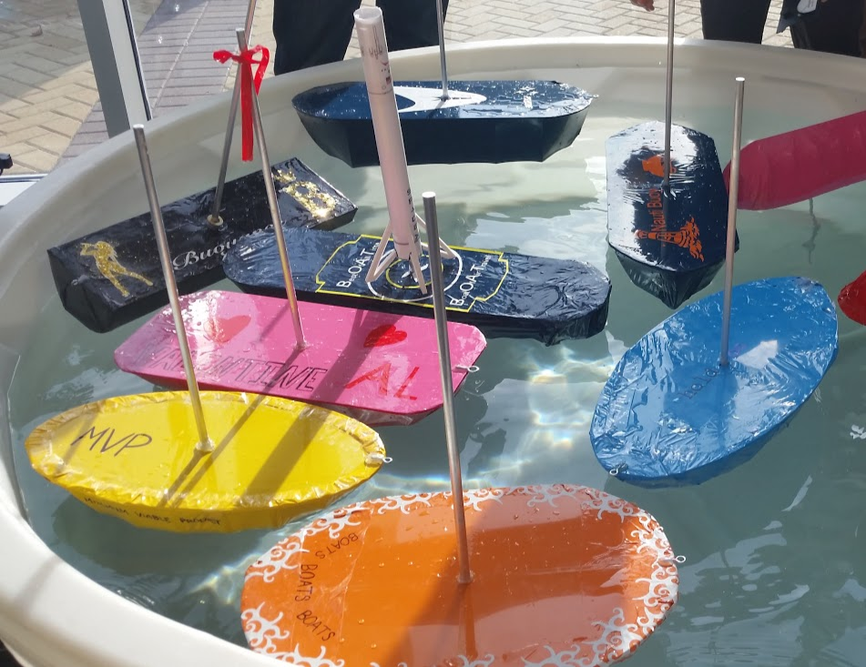
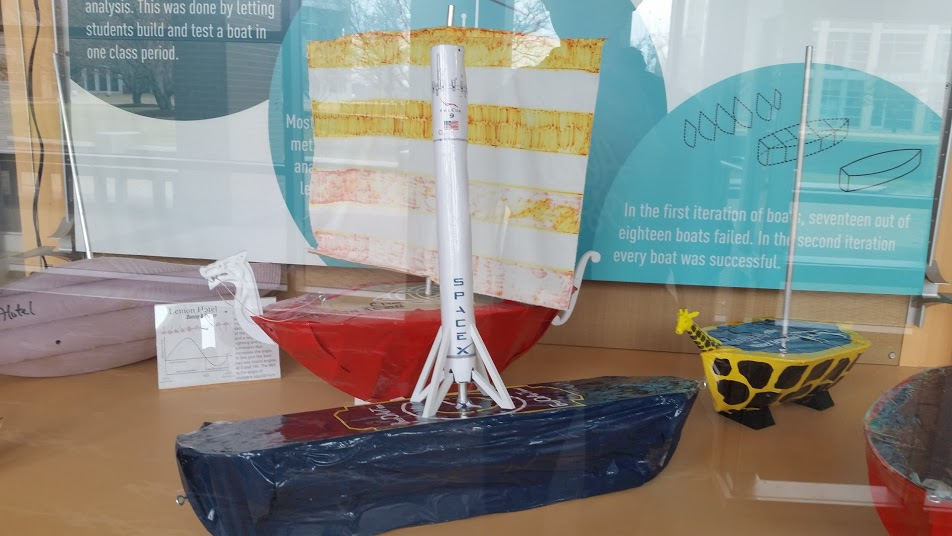

In this project, we applied concepts from multivariable calculus and physics to create a mathematical model of our boat. The objective was to create a boat that had an [angle of vanishing stability (AVS)](http://sailskills.co.uk/Stability/sailskills_stability_stability_explained_AVS.html) at 130 degrees and optimize the hull shape for speed.

  {% include overlay.html
    file="/img/projects/portal-turret/portal-turret-game.jpg"
    padding-top="5px"
    width="35%"
    id="portal-turret-game"%}

Project partner: Kawin Nikomborirak

Kawin and I chose to optimize the hull shape first, then position ballast inside the boat as needed to have the center of mass that would result in the correct center of mass. Since the boat would be going at relatively low speeds (no hydroplaning), we chose to have our hull shape resemble a row boat. However, as we worked on the project, we realized that making a row boat with an AVS of 130 degrees would require a center of mass right at the bottom of the boat. To make this center of mass possible, we needed to add a keel so that our ballast had somewhere to go.

Photos from project:
CAD model of boat

Boat model with flow lines from SolidWorks Flow Simulation

Mathematical model of boat

Calculated stability curve

Boat assembly

Measuring the COM

Boats on demo day!

Our boat in a display case!

Final Deliverables
+ [Poster](https://drive.google.com/open?id=1iEd-SI95zQ6L0sc_Lgt8aN6uIrD7Ud8T)
+ [Code](https://github.com/AmyPhung/qea-boat)

Tools Used:
- **MATLAB**
- **SolidWorks**
- **Python**
