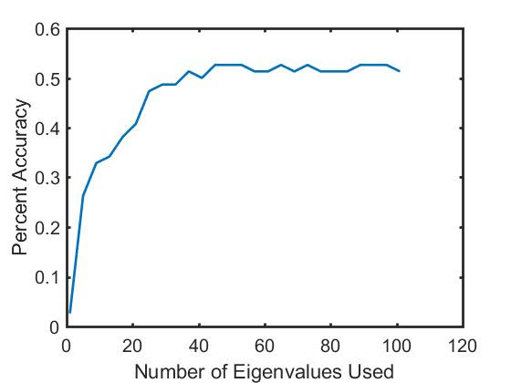
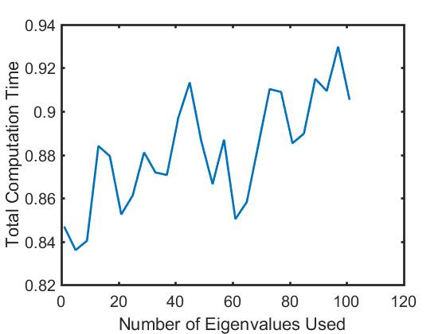
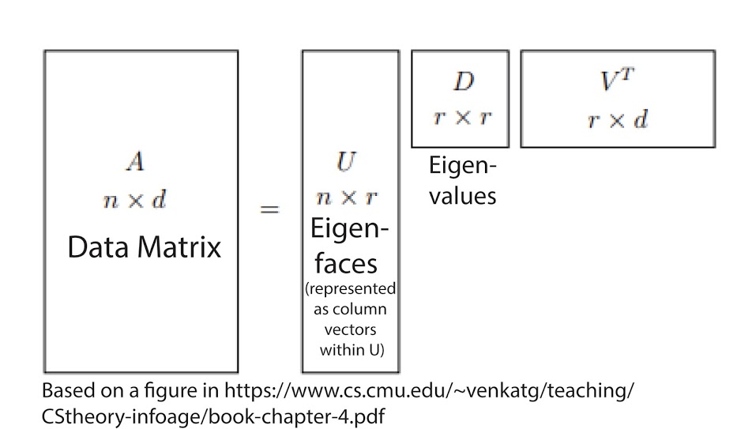
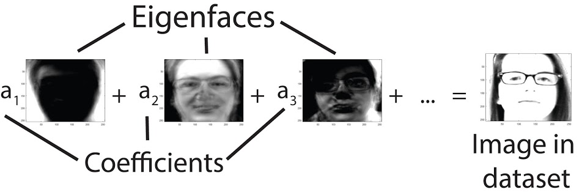

This class project involved using eigenvectors and the Fisherface algorithm to create a facial recognition program in MATLAB. One of the main objectives of this project was to become more familiar with core linear algebra concepts and provide scaffolding for learning how to apply these concepts to the inconsistency of real-world data.

Project Partner: Sarah Deng

Final deliverable: [Project Report](
https://drive.google.com/open?id=1LO9RhMCf81uIzvCRr7qmsoYnYnqo7jR1)

Images from project:

Tools used:
- **MATLAB** - used for calculating eigenvectors and plotting results
