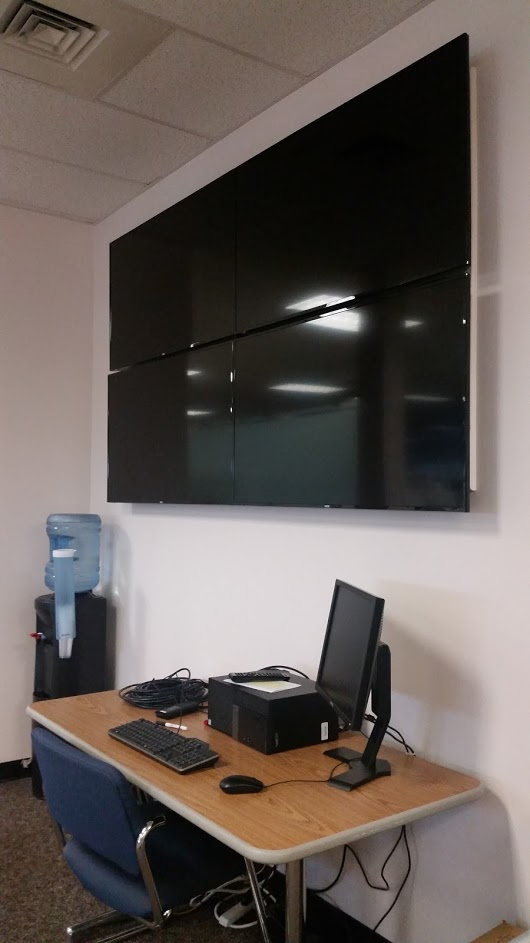

## Here are some of my favorite projects:

<!--
  | | 
:-------------------------:|:-------------------------:|:------------:|
**Autonomous Research Tractor** | **Rotorcraft Operations Center** | **OpenCV Fruit Ninja**
-->

<table class="tg">
  <tr>
    <th class="tg-us36">

      
    

    </th>

    <th class="tg-us36">

      
    

    </th>

    <th class="tg-us36">

      
    

    </th>

  </tr>
  <tr>
    <td class="tg-us36"><b>Autonomous Research Tractor</b></td>
    <td class="tg-us36"><b>Autonomous Research Tractor</b></td>
    <td class="tg-us36"><b>Autonomous Research Tractor</b></td>
  </tr>
</table>

<body>

<h2>Polaroid Images / Cards</h2>

The box-shadow property can be used to create paper-like cards:

  
  

    
Hardanger, Norway

  

</head>
<body>

<h2>Responsive Polaroid Images / Cards</h2>

<table>
  <tr>
    <th>
      

        
        

          
Cinque Terre

        

      

    </th>

    <th>
      

        
        

          
Northern Lights

        

      

    </th>
  </tr>
</table>

<head>
  <title>Bootstrap Example</title>
  <meta charset="utf-8">
  <meta name="viewport" content="width=device-width, initial-scale=1">
  <link rel="stylesheet" href="https://maxcdn.bootstrapcdn.com/bootstrap/3.3.7/css/bootstrap.min.css">
  
  
</head>
<body>

  <h1>My First Bootstrap Page</h1>
  
Resize this responsive page to see the effect!

  

    

      <h3>Column 1</h3>
      
Lorem ipsum dolor sit amet, consectetur adipisicing elit...

      
Ut enim ad minim veniam, quis nostrud exercitation ullamco laboris...

      

        
        

          
Cinque Terre

        

      

    

    

      <h3>Column 2</h3>
      
Lorem ipsum dolor sit amet, consectetur adipisicing elit...

      
Ut enim ad minim veniam, quis nostrud exercitation ullamco laboris...

      
    

    

      <h3>Column 3</h3>        
      

        
        

      
Lorem ipsum dolor sit amet, consectetur adipisicing elit...

      
Ut enim ad minim veniam, quis nostrud exercitation ullamco laboris...

    

  

</body>
